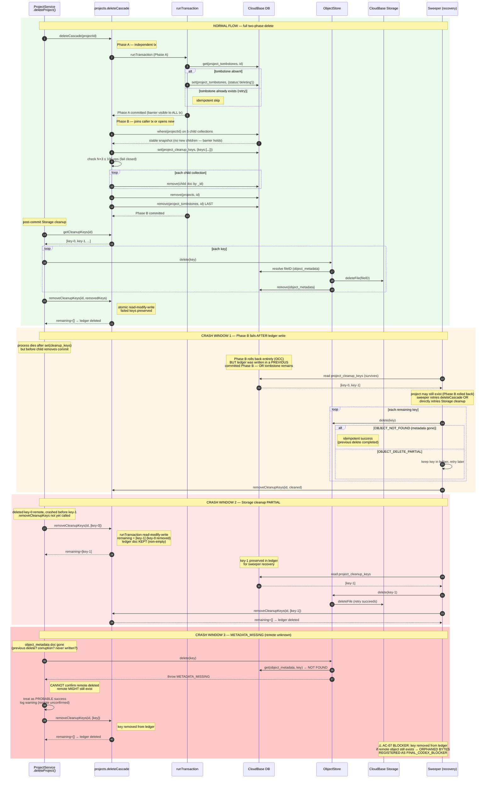

# Lumen Ink V2 — CloudBase NoSQL Persistence Layer
## Portfolio Case Study

> **Task:** LUMEN-NOSQL-FINAL-CLOSURE-BATCH-01 (Section D — 官网展示闭合 / Portfolio showcase)
> **Risk Level:** HIGH
> **Branch:** `lumen/nosql-final-closure-batch-01-trae`
> **Adapter source:** `src/server/infrastructure/persistence/cloudbase.nosql.ts`
> **Test suite:** `src/server/infrastructure/persistence/cloudbase.nosql.final-closure.test.ts`

---

## 1. Case Study Overview

This case study documents the **CloudBase NoSQL (MongoDB-compatible) persistence adapter** built for the Lumen Ink V2 AI image-editing platform — a serverless, crash-safe data layer that replaces the PostgreSQL adapter for environments where PostgreSQL is not provisioned (`RuntimeMode=nosql`). The adapter implements the frozen `PersistenceDependencies` interface (7 repositories — `ProjectRepository`, `AssetRepository`, `VersionRepository`, `JobRepository`, `ObjectStore`, `UnitOfWork`, `AuthThrottleRepository`) against CloudBase's serverless document database and Storage SDK, persisting every entity as a JSON document keyed by `_id` while routing binary image bytes through CloudBase Storage with an `object_metadata` side-table that maps `storageKey → fileID`. The headline engineering achievement is a **two-phase cascade delete with a visible tombstone barrier and a cleanup ledger** that survives the deleting transaction so a background sweeper can recover orphaned Storage bytes across three distinct crash windows, combined with **Optimistic Concurrency Control (OCC) with automatic retry**, a **fail-closed Preview/Production isolation gate** driven by mandatory `CLOUDBASE_DATA_NAMESPACE` + `CLOUDBASE_STORAGE_PREFIX` configuration, and **deterministic idempotency keys** that make Job and Version creation safe to retry. The implementation is validated by **636 tests (442 server + 194 client)** covering normal flows, boundary conditions, concurrency, crash-window recovery, and exception paths, while remaining **`readyForPreview = false`** pending real CloudBase Preview verification.

---

## 2. Architecture Diagram

```mermaid
flowchart TB
    subgraph Client["Client (React 19 + Vite 6)"]
        UI[AppV2 / useProject hook<br/>polls every 1.5s]
    end

    subgraph Edge["Vercel Serverless (Express 4)"]
        API[API Routes<br/>/api/projects, /api/jobs, /api/edit]
        subgraph Services["Service Layer"]
            PS[ProjectService<br/>atomic upload → DB tx → complete]
            GS[GenerationService<br/>claim → generate → save → succeeded]
        end
    end

    subgraph Domain["Frozen Domain Contract"]
        PD[(PersistenceDependencies<br/>7 repositories + ObjectStore + UnitOfWork)]
    end

    subgraph Adapter["CloudBaseNoSqlAdapter<br/>src/server/infrastructure/persistence/cloudbase.nosql.ts"]
        ALS[AsyncLocalStorage<br/>propagates active Transaction<br/>to nested repo calls]
        TXA["withCurrentOrNewTransaction<br/>reuses outer tx OR opens one<br/>no nested runTransaction"]
        TOMB["Tombstone Barrier<br/>Phase A: write 'deleting' marker"]
        LEDG["Cleanup Ledger<br/>Phase B: snapshot keys → doc"]
    end

    subgraph CloudBase["CloudBase (tcb.init)"]
        subgraph DB["Document Database — MongoDB-compatible"]
            C1[projects]
            C2[assets]
            C3[versions]
            C4[jobs]
            C5[version_idempotency]
            C6[job_idempotency]
            C7[auth_throttle]
            C8[object_metadata<br/>storageKey → fileID]
            C9[project_tombstones]
            C10[project_cleanup_keys]
        end
        subgraph Storage["Storage SDK"]
            UP[uploadFile → fileID]
            DL[downloadFile]
            DEL[deleteFile]
            URL[getTempFileURL]
        end
    end

    UI -->|HTTPS / Idempotency-Key| API
    API --> PS
    API --> GS
    PS -->|implements| PD
    GS -->|implements| PD
    PD -->|delegated to| ALS
    ALS --> TXA
    TXA --> TOMB
    TXA --> LEDG

    Adapter -->|namespaced `${ns}_*`| C1
    Adapter --> C2
    Adapter --> C3
    Adapter --> C4
    Adapter --> C5
    Adapter --> C6
    Adapter --> C7
    Adapter --> C8
    Adapter --> C9
    Adapter --> C10

    Adapter -->|prefix `${prefix}/`| UP
    Adapter -->|resolve fileID| DL
    Adapter -->|resolve fileID| DEL
    Adapter -->|resolve fileID| URL

    TOMB -.->|Phase A commits<br/>BEFORE Phase B| C9
    LEDG -.->|Phase B writes snapshot| C10
```

**Key invariants encoded in the diagram:**

- Every collection is prefixed with `${dataNamespace}_` and every cloudPath with `${storagePrefix}/`, so **Preview and Production data cannot collide** even on the same CloudBase env. Missing values fail closed via `validateCloudBaseNoSqlConfig`.
- `AsyncLocalStorage` carries the active `CloudBaseTransaction` so nested repository calls (e.g. `assets.create` → `assertProjectWritable` + `add`) join the caller's `unitOfWork.run()` instead of opening independent nested transactions — fixing the original P0-02 transaction-escape bug.
- The tombstone (Phase A) commits in a **separate, independent transaction** before Phase B begins, so it becomes visible to all concurrent transactions and blocks new child creates with `PROJECT_DELETING`.

---

## 3. Deletion Recovery Sequence Diagram



### Crash-window semantics summary

| Crash window | Trigger | Ledger state | Recovery path | Final state |
|---|---|---|---|---|
| **1** | Phase B fails after ledger write | Ledger survives (separate prior commit) | Sweeper reads ledger, retries Storage cleanup | `confirmed_deleted` |
| **2** | Storage cleanup partial | Ledger keeps failed keys (`removeCleanupKeys` preserves them) | Sweeper retries remaining keys | `confirmed_deleted` |
| **3** | `METADATA_MISSING` (remote unknown) | Key removed from ledger (treated as probable success) | None — ledger no longer tracks key | `unresolved_metadata_missing` / **AC-07 BLOCKER** |

> **AC-07 FINAL_CODEX_BLOCKER:** When `objects.delete()` cannot find `object_metadata`, it throws `METADATA_MISSING` because it cannot confirm the remote Storage object is gone. `ProjectService.deleteProject` currently treats this as probable success (crash-window recovery) and removes the key from the ledger. If the remote object actually still exists, it becomes **orphaned bytes** that no sweeper can recover — there is no `fileID` to retry. This behavior is verified by test *AC-06 Test 2* and registered as a `FINAL_CODEX_BLOCKER` in the remaining-risk ledger. Resolution requires a remote-object enumeration capability CloudBase Storage does not currently expose via the SDK.

---

## 4. Technical Highlights

### Two-phase delete with tombstone barrier (concurrent safety)
`projects.deleteCascade()` splits deletion into two transactions. **Phase A** writes a `{_id, status:'deleting', startedAt}` tombstone in an *independent* `runTransaction` that commits before Phase B starts. Once committed, the tombstone is visible to ALL concurrent transactions — any `assets.create` / `versions.create` / `jobs.create` that calls `assertProjectWritable` sees it and throws `PROJECT_DELETING`. This guarantees Phase B reads a **stable snapshot** of child IDs and Storage keys: no new children can appear while deletion is in flight. The tombstone is removed LAST in Phase B; after its removal, child creates that check project existence fail with `PROJECT_NOT_FOUND` (no orphans possible).

### OCC (Optimistic Concurrency Control) with automatic retry
`removeCleanupKeys` uses `runTransaction` for an atomic read-modify-write of the cleanup ledger. If two concurrent workers both read the same ledger snapshot, CloudBase's OCC detects the conflict on commit and **retries the callback** (re-reading the latest committed state) up to **`MAX_TX_ATTEMPTS = 3`** times. This prevents the resurrection of already-cleaned keys. Retry exhaustion (all 3 attempts conflict) propagates the error and leaves the ledger **unchanged** — no partial key removal (verified by *AC-05 Test 1*).

### Cleanup ledger lifecycle
The `project_cleanup_keys` document survives the Phase B transaction to drive post-commit Storage cleanup and sweeper recovery. Its lifecycle:

```
pending (keys snapshot written in Phase B)
   │
   ├─ all keys cleaned  →  ledger doc DELETED  (confirmed_deleted)
   ├─ key already gone  →  OBJECT_NOT_FOUND treated as success  (already_absent)
   ├─ metadata missing  →  METADATA_MISSING, probable success  (unresolved_metadata_missing) ⚠️ AC-07 BLOCKER
   ├─ transient failure →  key PRESERVED in ledger  (retryable_failure) → sweeper retries
   └─ permanent failure →  key PRESERVED in ledger  (permanent_failure) → manual intervention
```

### 5-state deletion semantics
Every Storage key processed by `ProjectService.deleteProject` resolves to exactly one of five terminal states, making crash-window recovery deterministic:

1. **confirmed deleted** — SDK returned code 0, metadata removed
2. **already absent** — SDK returned "not found" / "no such file" (idempotent success)
3. **metadata missing / remote unknown** — `METADATA_MISSING`; probable success but remote NOT confirmed (AC-07 BLOCKER)
4. **retryable failure** — `OBJECT_DELETE_PARTIAL` or transient SDK error; key stays in ledger for sweeper
5. **permanent failure** — unrecoverable SDK error; key stays in ledger for manual intervention

### Preview/Production isolation gate (fail-closed)
`validateCloudBaseNoSqlConfig` requires four non-empty fields: `envId`, `apiKey`, `dataNamespace`, `storagePrefix`. An unset `dataNamespace` or `storagePrefix` is **rejected at adapter construction** (`CLOUDBASE_CONFIG_REQUIRED`) — it never falls back to a default that could silently share Production data. Preview and Production configure distinct values (`preview_*` / `prod_*`), enforced by `VERCEL_ENV`-aware wiring. This is a fail-closed design: misconfiguration crashes the process rather than risking cross-environment data leakage.

### JobPatch three-state semantics
`buildUpdateFromPatch` translates a `JobPatch` into CloudBase field-level command operators using three explicit states:

| Patch field state | Translation | Effect |
|---|---|---|
| **absent** (`undefined`) | not included in update | preserve existing value (skip) |
| **present, `null`** | `command.remove()` | remove field / write null |
| **present, value** | `command.set(value)` | write new value |

This eliminates ambiguity between "don't touch this field" and "clear this field" — critical for lease/heartbeat updates where `leaseToken` must be set while `error` may be cleared.

### AsyncLocalStorage for transaction propagation
`transactionStorage = new AsyncLocalStorage<{ tx: CloudBaseTransaction }>()` carries the active transaction through the async call chain. `withCurrentOrNewTransaction` checks the store: if a transaction is already active (caller is inside `unitOfWork.run()`), it **reuses** it — the raw `runTransaction()` counter does NOT increase. This fixes the original P0-02 bug where nested `runTransaction()` calls created independent transactions that escaped the outer context. Transaction collection references are type-narrowed (`TransactionCollectionRef` has no `where()`/`count()`), so TypeScript rejects transaction code that tries to call non-transactional operations at compile time.

### 100-operation transaction limit with fail-closed design
CloudBase enforces a maximum of **100 document operations per transaction**. `deleteCascade` Phase B computes `totalOps = totalChildOps + 3` (cleanup keys set + project remove + tombstone remove) and throws `CLOUDBASE_TX_LIMIT_EXCEEDED` *before* issuing any remove. The tombstone from Phase A remains committed — child creates stay blocked — and the caller must reduce children before retrying. No partial deletion is ever committed.

### Idempotent operations with deterministic keys
Version and Job idempotency records use a deterministic `_id = ${projectId}__${idempotencyKey}`. `createIdempotent` performs a fast-path existence check, then re-checks *inside* a transaction to guard against concurrent inserts. On `E11000` (duplicate key), the non-transaction path re-reads the winner and returns it; the transaction path lets the outer transaction fail and retry as a unit. The `(projectId, key)` scope prevents different projects from colliding on the same key (a FIX-R1 bug).

### Test coverage
**636 tests (442 server + 194 client)** covering:
- **Normal flows** — CRUD, version creation, job lifecycle, idempotent create, cascade delete
- **Boundary conditions** — 100-op limit, empty patches, missing config fields, adapter not-ready
- **Concurrency** — two `deleteCascade` with different snapshots (AC-04), tombstone barrier holding, OCC conflict retry
- **Crash-window recovery** — Phase B failure after ledger write, partial Storage cleanup, `METADATA_MISSING` remote-unknown (AC-06), `IDEMPOTENT_VERSION_INCONSISTENT_STATE`
- **Exception paths** — transaction retry exhaustion (AC-05), adapter init failure with no side effects (AC-10), upload/metadata/compensation-delete failure matrix

---

## 5. Demo Script

A step-by-step walkthrough for a live demo of the persistence layer against a CloudBase Preview environment.

### Step 1 — Create a project → show it in CloudBase DB
1. From the V2 workbench, click **New Project** and name it "Demo Shoot 01".
2. The client `POST /api/projects` carries an `Idempotency-Key` header.
3. `ProjectService.createProject` calls `projects.create` → `projects.add({ _id, name, createdAt, updatedAt })`.
4. Open the **CloudBase console → Database** and show the `preview_projects` collection with the new document. Highlight the `_id` field as the primary key.

### Step 2 — Upload an asset → show Storage upload + metadata mapping
1. Drag a JPEG/PNG into the workbench. The client `POST /api/projects/:id/assets`.
2. `ProjectService` runs `validateImageBytes` (7-step validation), then:
   - `objects.put(storageKey, bytes, mimeType)` → `app.uploadFile({ cloudPath: 'preview/...', fileContent })` → returns `fileID`
   - `saveFileMetadata(storageKey, fileID, mimeType, sizeBytes)` → writes `preview_object_metadata`
   - `assets.create` → writes `preview_assets` (inside the same `unitOfWork.run()` that called `assertProjectWritable`)
3. In the CloudBase console, show:
   - **Storage** — the `preview/`-prefixed object with its `fileID`
   - **Database → `preview_object_metadata`** — the `{ _id: storageKey, fileID, mimeType, sizeBytes, createdAt }` mapping document
4. Emphasize: the `storageKey` is the logical key; the `fileID` is the CloudBase Storage handle. They are decoupled by `object_metadata`.

### Step 3 — Create a version → show idempotency record
1. Trigger **Generate Preview**. The client `POST /api/projects/:id/jobs` with an `Idempotency-Key`.
2. `GenerationService.executeJob` runs the 9-stage lifecycle (claim → upload → analyze → generate → postprocess → save → succeeded).
3. On success, `versions.createIdempotent(projectId, key, version)`:
   - Fast-path check on `preview_version_idempotency` doc `_id = ${projectId}__${key}`
   - Inside a transaction: re-check, `assertProjectWritable`, `versions.add`, `version_idempotency.add` (atomic)
4. In the console, show:
   - `preview_versions` — the immutable version document
   - `preview_version_idempotency` — the `{ _id: 'proj__key', projectId, key, versionId, createdAt }` record
5. Trigger the same generation again with the same `Idempotency-Key` → show the existing version is returned, no duplicate created.

### Step 4 — Delete the project → walk through two-phase delete
1. Click **Delete Project**. The client `DELETE /api/projects/:id`.
2. `ProjectService.deleteProject` calls `projects.deleteCascade(id)`:
   - **Phase A** (independent transaction): writes `preview_project_tombstones` `{ _id, status:'deleting', startedAt }`. Show this doc in the console — it is now the barrier.
   - **Phase B** (joins/opens transaction): reads stable snapshot of 5 child collections, writes `preview_project_cleanup_keys` `{ _id, keys: [...] }`, removes all children + project + tombstone (tombstone LAST).
3. Show the console: `preview_projects`, `preview_assets`, `preview_versions`, `preview_jobs`, `preview_version_idempotency`, `preview_job_idempotency` are now EMPTY for this project. `preview_project_cleanup_keys` still exists with the Storage key snapshot.

### Step 5 — Show cleanup ledger → Storage cleanup → ledger removal
1. Back in `ProjectService.deleteProject` (post-commit phase): `projects.getCleanupKeys(id)` returns `[key-0, key-1]`.
2. For each key: `objects.delete(key)` → resolve `fileID` via `object_metadata` → `app.deleteFile({ fileList: [fileID] })` → remove `object_metadata` doc.
3. `projects.removeCleanupKeys(id, [key-0, key-1])`:
   - `runTransaction`: read ledger, compute `remaining = []`, **delete** the ledger doc.
4. Show the console: `preview_project_cleanup_keys` is GONE. `preview_object_metadata` docs are gone. Storage objects are gone.

### Step 6 — Simulate crash window → show sweeper recovery
1. **Simulate Crash Window 2** (partial Storage cleanup): inject a fault so `deleteFile` fails for `key-1` after `key-0` succeeds.
2. `ProjectService.deleteProject` calls `removeCleanupKeys(id, [key-0])`. Show in the console: the ledger doc STILL EXISTS with `keys: [key-1]` — the failed key is preserved.
3. Run the **sweeper** (or retry `deleteProject`): it reads `preview_project_cleanup_keys`, sees `[key-1]`, calls `objects.delete('key-1')`. This time it succeeds.
4. `removeCleanupKeys(id, [key-1])` → ledger now empty → doc deleted.
5. **Simulate Crash Window 3** (AC-07 BLOCKER): manually delete the `object_metadata` doc for a key before cleanup. Call `objects.delete(key)` → it throws `METADATA_MISSING`. Show the warning log: *"cannot confirm remote deletion (metadata not found)"*. Show the key is removed from the ledger (probable success) — and explain the FINAL_CODEX_BLOCKER risk: if the remote object still exists, it is orphaned.

---

## 6. Screenshot Checklist

Capture the following screenshots for the portfolio showcase. All screenshots must be **de-identified** (no real customer photos, no API keys, no un-redacted Storage URLs) per the AGENTS.md public-repository security boundary.

- [ ] **CloudBase console — `preview_*` collections**: Database view showing the namespaced collections (`preview_projects`, `preview_assets`, `preview_versions`, `preview_jobs`, `preview_version_idempotency`, `preview_job_idempotency`, `preview_auth_throttle`, `preview_object_metadata`, `preview_project_tombstones`, `preview_project_cleanup_keys`).
- [ ] **CloudBase Storage — `preview/`-prefixed objects**: Storage browser showing uploaded objects under the `preview/` prefix, with `fileID` values visible.
- [ ] **Vercel deployment logs — successful Preview build**: Vercel dashboard showing the Preview deployment for branch `lumen/nosql-final-closure-batch-01-trae` with a green "Ready" status and build logs showing no errors.
- [ ] **Test runner output — 636 tests passing**: Terminal screenshot of the unified test gate showing `442 server + 194 client = 636 tests passed`, lint `0 errors`, typecheck, and build all green.
- [ ] **Architecture diagram rendered**: The Mermaid diagram from Section 2 rendered (e.g. via the GitHub Mermaid renderer or mermaid.live) showing the Client → API → Service → PersistenceDependencies → CloudBaseNoSqlAdapter → CloudBase DB + Storage flow.
- [ ] **Sequence diagram rendered**: The Mermaid deletion-recovery sequence diagram from Section 3 rendered, showing the normal flow plus the three crash windows and the AC-07 BLOCKER annotation.

---

## 7. Status Declaration

> **Engineering validated; final repository audit and real CloudBase Preview pending.**

This case study documents the **engineering implementation and its test-validated behavior** against the in-memory CloudBase mock (`cloudbase.nosql.mock.ts`). The following statements are explicitly **NOT** claimed:

- ❌ **NOT** claimed: production complete.
- ❌ **NOT** claimed: real CloudBase verified. No real CloudBase DB or Storage API/SDK writes have been performed; all behavior is validated against the mock that models the SDK contracts the adapter relies on.
- ❌ **NOT** claimed: merged to `main`. The adapter lives on branch `lumen/nosql-final-closure-batch-01-trae`.

**State flags:**

| Flag | Value | Source |
|---|---|---|
| `readyForPreview` | **`false`** | `docs/lumen-v2/state/STATE.json` line 164 |
| Real CloudBase Preview deployment | **not performed** | Stop conditions: no Vercel Preview/Production config, no Production API Key usage |
| Real CloudBase DB/Storage writes | **not performed** | Stop conditions: no real CloudBase API/Storage writes, `@cloudbase/node-sdk` not upgraded |
| Merge to `main` | **not performed** | Stop conditions: no merge to main |
| `PersistenceDependencies` interface | **unchanged (frozen)** | Codex-confirmed; the adapter implements, never modifies, the frozen surface |

**Known open risk — AC-07 FINAL_CODEX_BLOCKER:**
The `METADATA_MISSING` crash-window (Section 3, Crash Window 3) treats an unconfirmable remote-object state as probable success and removes the key from the cleanup ledger. If the remote Storage object still exists when metadata is missing, it becomes orphaned bytes that no sweeper can recover (there is no `fileID` to retry). This is registered as a `FINAL_CODEX_BLOCKER` and must be resolved (via a CloudBase Storage enumeration capability or an alternative orphan-detection mechanism) before the adapter can move to `readyForPreview = true`.

---

*End of case study — LUMEN-NOSQL-FINAL-CLOSURE-BATCH-01, Section D.*
